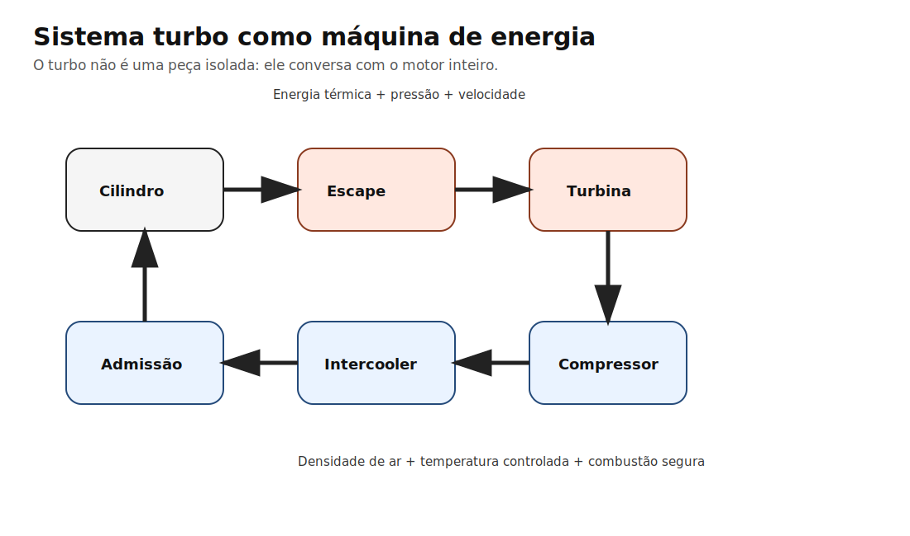

# Capítulo 1 — O que realmente é um motor turbo?

> **Como ler este capítulo**  
> 🔵 Leia os blocos essenciais para entender a ideia.  
> 🟠 Leia os blocos de entusiasta para entender o porquê.  
> 🔴 Leia as aplicações práticas para decidir peça e acerto.  
> ⚫ Leia a engenharia quando quiser ir até o porão físico da coisa.

## Pergunta de abertura

Se um motor aspirado já respira ar sozinho, por que alguém colocaria uma máquina girando a centenas de milhares de rpm entre o escape e a admissão?

A ideia central deste manual é simples, mas dá trabalho: **preparação não é decorar peça, é entender comportamento de energia**. Um AP turbo não anda porque tem uma turbina famosa. Ele anda porque o conjunto preserva, converte e controla energia de maneira eficiente.

## 🍻 Engenharia de boteco

Imagine um restaurante com uma cozinha excelente, mas com garçons lentos. A comida existe, o fogão funciona, o chef sabe cozinhar, mas o salão não recebe pratos na velocidade certa. O turbo é como criar uma esteira inteligente usando energia que já estava indo embora pela porta dos fundos. Ele não inventa comida. Ele aumenta a capacidade de entrega.

Essa seção existe para transformar uma coisa abstrata em algo que cabe na cabeça antes de caber na fórmula. O leitor técnico pode pular? Pode. Mas quase sempre é aqui que a intuição nasce.

## 🧠 Curiosidades

Um turbo pode estar girando muito rápido e ainda assim estar trabalhando fora da melhor região. Também é possível aumentar a pressão e ganhar pouca potência se a temperatura subir demais. O número no manômetro é o personagem famoso, mas a massa de ar é quem realmente paga a conta.

## 🟦 Essencial

Quando alguém fala em capítulo 1 — o que realmente é um motor turbo?, normalmente está apontando para uma consequência visível. O barulho, o número de pressão, a potência de pico e o gráfico bonito são sintomas. O trabalho real acontece antes: fluxo, temperatura, pressão, massa de ar e tempo.

## 🟧 Entusiasta: o porquê

O turbo converte energia dos gases de escape em trabalho no compressor. O compressor aumenta a pressão e a temperatura do ar. O intercooler tenta devolver densidade retirando calor. O motor recebe mais massa de oxigênio por ciclo, então pode queimar mais combustível com controle. Potência vem de mais massa de mistura útil queimando no momento certo, não de pressão isolada.

O ponto que separa um projeto bom de um projeto apenas caro é saber reconhecer **qual variável manda no resultado**. Às vezes o gargalo é a turbina. Às vezes é o coletor. Às vezes é o intercooler. Muitas vezes é o acerto.

## 🔴 Oficina: aplicação prática

Em um AP 2.0 de rua, o turbo certo não é o maior que cabe no cofre. É aquele que entra na faixa de eficiência perto da rotação onde você realmente usa o carro. Para arrancada, pode aceitar threshold mais alto. Para rua e track day, resposta e controle térmico importam muito mais.

Em preparação real, a pergunta rara vez é “qual é a melhor peça?”. A pergunta honesta é: **melhor para qual motor, em qual faixa de rpm, com qual combustível, qual câmbio, qual pneu e qual orçamento?**

## ⚫ Engenharia: como pensar em números

Mesmo quando não temos todos os dados, dá para trabalhar com uma sequência lógica:

1. Definir meta de potência e rpm útil.
2. Estimar massa de ar necessária.
3. Estimar pressão de admissão e temperatura.
4. Estimar restrição no escape.
5. Verificar se a turbina trabalha dentro de uma região eficiente.
6. Validar com instrumentação: sonda, EGT, pressão antes da turbina, pressão de coletor, temperatura de admissão e, quando possível, rotação do turbo.

Não é necessário transformar todo carro de rua em laboratório, mas um projeto sério deve saber **o que gostaria de medir**.

## ❌ Erros comuns

Achar que turbo cria potência sozinho; escolher turbina por pressão máxima; ignorar intercooler; confundir lag com boost threshold; comparar setups sem olhar combustível, comando, coletor, câmbio e pneu.

## 🧪 CFD simplificado: como ler os diagramas deste manual

Os desenhos deste manual **não são CFD real**. Eles são mapas conceituais de fluxo. Servem para indicar regiões prováveis de aceleração, recirculação, mistura de pulsos e perda de energia. CFD real exigiria CAD do coletor, malha, condições de contorno, temperatura, pulso por cilindro, rugosidade, material, rotação do motor e solver transiente.

Use os diagramas como bússola, não como dinamômetro.

## 🧩 Aplicando ao Projeto Marcelo

Para o Gol AP 2.0 com meta inicial de 300 cv, o foco deve ser densidade de ar com temperatura controlada e resposta boa, não potência de catálogo. Uma R4449 pode entregar a meta com custo baixo; uma A50-2.48P com coletor pulsativo dá mais margem e melhora o uso misto. Garrett G25/EFR entram quando orçamento e ambição passam a justificar salto tecnológico.

## O que você deve lembrar daqui 10 anos

> Turbo é uma máquina de conversão de energia: ele usa parte da energia do escape para aumentar a massa de ar que entra no motor.

## Referências usadas neste capítulo

Índice completo: [Referências — Volume I](../apendices/referencias.md#volume-i--turbo-e-sistema-de-admissao-pressurizada)

- **`garrett-compressor-maps`** — 🔬 Fabricante oficial. Mapa de compressor, eficiência, fluxo de massa.  
  Fonte: https://www.garrettmotion.com/knowledge-center-category/oem/expert/
- **`garrett-engine-basics`** — 🔬 Fabricante oficial. Conversão energia escape → massa de ar admissão.  
  Fonte: https://www.garrettmotion.com/knowledge-center-category/oem/expert/
- **`garrett-g25-550`** — 🔬 Fabricante oficial. Faixa HP **declarada** 300–550; rotor 48×60 mm; mapa oficial.  
  Fonte: https://www.garrettmotion.com/racing-and-performance/performance-catalog/turbo/g-series-g25-550/
- **`borgwarner-efr-6258`** — 🔬 Fabricante oficial. Faixa HP **declarada** 225–450; mapa compressor PDF.  
  Fonte: https://www.borgwarner.com/docs/default-source/iam/boosting-technologies/efr-6258-a.pdf?sfvrsn=595bb03c_17

> ⚠️ Faixas HP de catálogo **não** são potência de roda medida no AP. Resultado real depende de coletor, pressão, IAT, combustível e acerto.
