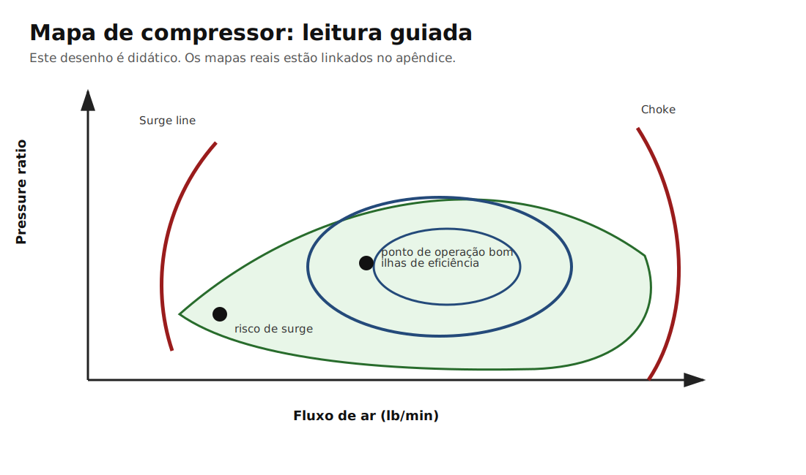

# Capítulo 3 — Compressor e mapas: onde o ar vira densidade

> **Como ler este capítulo**  
> 🔵 Leia os blocos essenciais para entender a ideia.  
> 🟠 Leia os blocos de entusiasta para entender o porquê.  
> 🔴 Leia as aplicações práticas para decidir peça e acerto.  
> ⚫ Leia a engenharia quando quiser ir até o porão físico da coisa.


## Pergunta de abertura

Como saber se uma turbina está trabalhando feliz ou se ela está só esquentando ar e fingindo potência?

A ideia central deste manual é simples, mas dá trabalho: **preparação não é decorar peça, é entender comportamento de energia**. Um AP turbo não anda porque tem uma turbina famosa. Ele anda porque o conjunto preserva, converte e controla energia de maneira eficiente.





## 🍻 Engenharia de boteco

Imagine uma bomba de encher pneu. Você pode encher rápido, devagar, aquecer a bomba, perder ar pela mangueira ou chegar numa pressão onde bombear fica inútil. O compressor do turbo é a bomba, mas girando como se tivesse tomado café nuclear.

Essa seção existe para transformar uma coisa abstrata em algo que cabe na cabeça antes de caber na fórmula. O leitor técnico pode pular? Pode. Mas quase sempre é aqui que a intuição nasce.

## 🧠 Curiosidades

Dois compressores de tamanho parecido podem ter mapas muito diferentes. Uma roda moderna pode entregar mais fluxo, menos calor e mais margem de surge que uma antiga. Por isso o número '50' na carcaça não conta a história inteira.

## 🟦 Essencial

Quando alguém fala em capítulo 3 — compressor e mapas: onde o ar vira densidade, normalmente está apontando para uma consequência visível. O barulho, o número de pressão, a potência de pico e o gráfico bonito são sintomas. O trabalho real acontece antes: fluxo, temperatura, pressão, massa de ar e tempo.

## 🟧 Entusiasta: o porquê

O mapa de compressor mostra fluxo de ar no eixo horizontal, pressure ratio no vertical, ilhas de eficiência, linhas de rotação, surge à esquerda e choke à direita. Garrett define o mapa como o gráfico que descreve características do compressor, incluindo eficiência, faixa de massa de ar, pressão e velocidade. O ponto ideal de operação fica longe da surge line, longe do choke e dentro de uma ilha de eficiência alta.

O ponto que separa um projeto bom de um projeto apenas caro é saber reconhecer **qual variável manda no resultado**. Às vezes o gargalo é a turbina. Às vezes é o coletor. Às vezes é o intercooler. Muitas vezes é o acerto.

## 🔴 Oficina: aplicação prática

Para AP 2.0 300 cv, o compressor precisa fornecer fluxo suficiente sem cair numa região quente. Em estimativa grossa, 300 cv no motor pode exigir algo perto de 30 lb/min, dependendo de BSFC, combustível, eficiência volumétrica e perdas. Turbos como R4449 e A50-2 trabalham nessa vizinhança; G25-550 e EFR 6258 sobram mais margem.

Em preparação real, a pergunta rara vez é “qual é a melhor peça?”. A pergunta honesta é: **melhor para qual motor, em qual faixa de rpm, com qual combustível, qual câmbio, qual pneu e qual orçamento?**

## ⚫ Engenharia: como pensar em números

Mesmo quando não temos todos os dados, dá para trabalhar com uma sequência lógica:

1. Definir meta de potência e rpm útil.
2. Estimar massa de ar necessária.
3. Estimar pressão de admissão e temperatura.
4. Estimar restrição no escape.
5. Verificar se a turbina trabalha dentro de uma região eficiente.
6. Validar com instrumentação: sonda, EGT, pressão antes da turbina, pressão de coletor, temperatura de admissão e, quando possível, rotação do turbo.

Não é necessário transformar todo carro de rua em laboratório, mas um projeto sério deve saber **o que gostaria de medir**.

## ❌ Erros comuns

Olhar apenas pressão; comparar compressor por diâmetro sem olhar mapa; achar que eficiência máxima é usada em toda faixa; ignorar que ar quente reduz densidade e aumenta risco de detonação.

## 🧪 CFD simplificado: como ler os diagramas deste manual

Os desenhos deste manual **não são CFD real**. Eles são mapas conceituais de fluxo. Servem para indicar regiões prováveis de aceleração, recirculação, mistura de pulsos e perda de energia. CFD real exigiria CAD do coletor, malha, condições de contorno, temperatura, pulso por cilindro, rugosidade, material, rotação do motor e solver transiente.

Use os diagramas como bússola, não como dinamômetro.

## 🧩 Aplicando ao Projeto Marcelo

A A50-2 tem compressor 51x71, maior que a R4449 44,05x63. Isso sugere mais margem de fluxo. Mas a resposta depende do conjunto rotativo e lado quente. Para 300 cv, ambas podem atender. Para evolução 350-400 cv, A50-2.48P e G25-550 passam a fazer mais sentido.

## O que você deve lembrar daqui 10 anos

> Mapa de compressor é o mapa da cidade: sem ele você até dirige, mas não sabe onde estão os becos sem saída.


## Como estimar um ponto de operação

Uma conta simplificada para começar:

```text
Potência alvo → consumo específico de combustível → massa de combustível → massa de ar → lb/min
```

Para entusiasta, o importante é saber a lógica. Para preparador, o valor precisa ser refinado com combustível, lambda, eficiência volumétrica, pressão, temperatura e perdas. Para engenheiro, o próximo passo é plotar pontos por rpm no mapa real.

## Mapas reais incluídos no projeto

Os mapas reais ficam referenciados no apêndice `apendices/mapas-de-compressor.md`. Neste capítulo usamos um desenho didático para ensinar leitura sem reproduzir imagem técnica proprietária.


## Referências usadas neste capítulo

Índice completo: [Referências — Volume I](../apendices/referencias.md#volume-i--turbo-e-sistema-de-admissao-pressurizada)

- **`garrett-compressor-maps`** — 🔬 Fabricante oficial. Eficiência, surge, choke, fluxo de massa no mapa.  
  Fonte: https://www.garrettmotion.com/knowledge-center-category/oem/expert/
- **`garrett-g25-550`** — 🔬 Fabricante oficial. Mapa e faixa HP declarada; exemplo de leitura de ponto de operação.  
  Fonte: https://www.garrettmotion.com/racing-and-performance/performance-catalog/turbo/g-series-g25-550/
- **`borgwarner-efr-6258`** — 🔬 Fabricante oficial. Mapa compressor PDF oficial EFR 6258.  
  Fonte: https://www.borgwarner.com/docs/default-source/iam/boosting-technologies/efr-6258-a.pdf?sfvrsn=595bb03c_17
- **`autoavionics-a50-248p`** — 🟡 Ficha comercial. Medidas de rotor; comparar com mapa antes de escolher.  
  Fonte: https://autoavionics.com.br/produto/a50-2-48p/
- **`masterpower-r4449-regis`** — 🟡 Ficha comercial revenda. Faixa 145–360 hp **declarada**; confirmar mapa com fabricante.  
  Fonte: https://www.regisracing.com.br/turbinas/master-power-turbo-r4449-2-145-360-hp-44-05-x-49-5

> ⚠️ **Fonte de confiabilidade limitada**: fichas 🟡 de revenda. Faixa HP não substitui mapa de compressor nem medição no AP.
