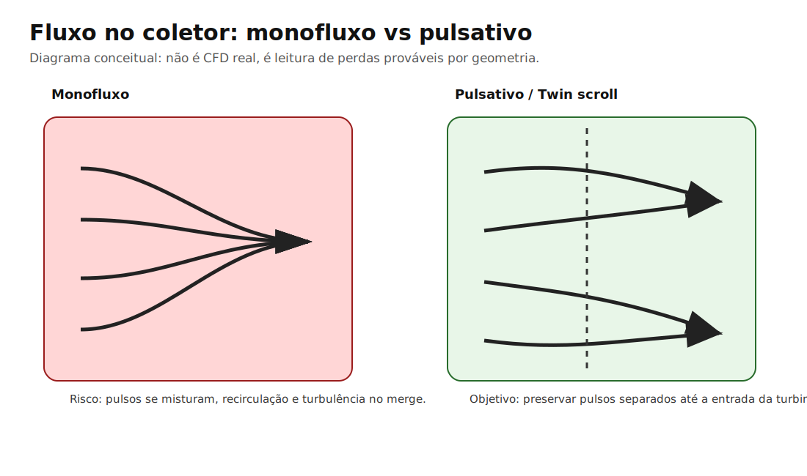
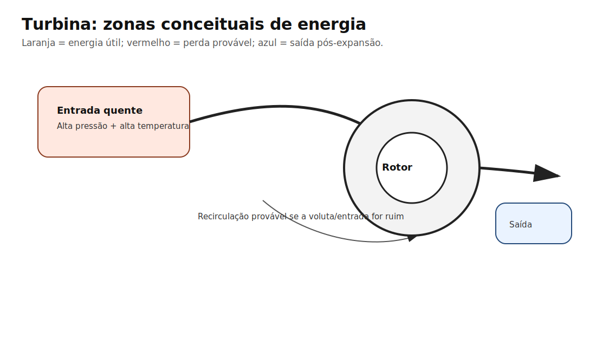

# Capítulo 16 — Metodologia de CFD simplificado

## Por que este capítulo existe

A comunidade brasileira fala muito de coletor, mas quase nunca separa três coisas:

1. **O que foi medido**
2. **O que foi simulado**
3. **O que foi inferido por engenharia**

Este manual usa diagramas de fluxo para ensinar raciocínio, não para fingir simulação. Isso precisa ficar explícito desde o começo.

## O que NÃO estamos fazendo

Não estamos rodando CFD transiente em OpenFOAM, ANSYS Fluent ou SimScale. Para isso seria necessário:

- modelo CAD interno do coletor;
- rugosidade interna;
- dimensões reais de flange e runners;
- temperatura dos gases;
- pressão no cilindro por fase de escape;
- pulso por cilindro;
- malha refinada;
- validação por medição.

Sem isso, qualquer número exato seria teatro técnico.

## O que estamos fazendo

Estamos criando **mapas conceituais de perda de energia**. Eles mostram regiões onde, por geometria, é provável ocorrer:

- mistura de pulsos;
- recirculação;
- separação de camada;
- turbulência;
- desaceleração;
- perda de direção;
- dificuldade da wastegate controlar o fluxo.

## Como interpretar uma cor ou zona

| Zona | Leitura |
|---|---|
| Fluxo alinhado | Boa preservação de energia |
| Curva brusca | Perda por mudança de direção |
| Merge abrupto | Mistura turbulenta |
| Volume morto | Recirculação provável |
| Entrada direta na wastegate | Bom controle de boost |
| Wastegate em sombra de fluxo | Risco de boost creep |

## Exemplo: monofluxo vs pulsativo

## Exemplo: turbina

## Como evoluir para CFD real futuramente

1. Escanear ou modelar o coletor em CAD.
2. Definir condições de contorno por cilindro.
3. Usar simulação transiente, não apenas fluxo estacionário.
4. Comparar com pressão pré-turbina medida.
5. Ajustar modelo.
6. Publicar resultados com incerteza e limitações.

## O que você deve lembrar

> Diagrama conceitual ensina direção. CFD real mede consequência.

## Referências usadas neste capítulo

Índice completo: [Referências — Volume I](../apendices/referencias.md#volume-i--turbo-e-sistema-de-admissao-pressurizada)

- **`manual-vol1-cfd`** — 📁 Manual interno. Metodologia de diagramas didáticos deste repositório.  
  Fonte: [Cap. 16 — Metodologia CFD simplificado](16-metodologia-cfd-simplificado.md)
- **`garrett-compressor-maps`** — 🔬 Fabricante oficial. Referência do que é mapa **real** vs diagrama didático.  
  Fonte: https://www.garrettmotion.com/knowledge-center-category/oem/expert/
- **`garrett-engine-basics`** — 🔬 Fabricante oficial. Conceitos de fluxo usados nos diagramas conceituais.  
  Fonte: https://www.garrettmotion.com/knowledge-center-category/oem/expert/

> Os SVG/Mermaid deste manual **não** são resultado de solver CFD. Nunca tratar como simulação numérica validada.
